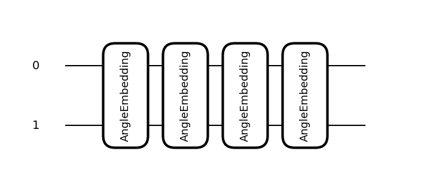
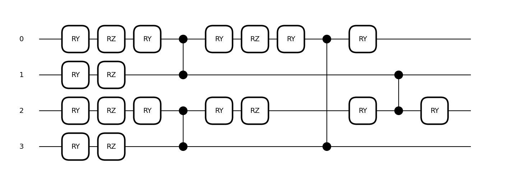
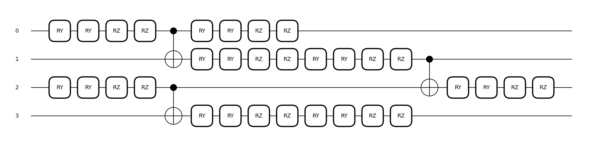
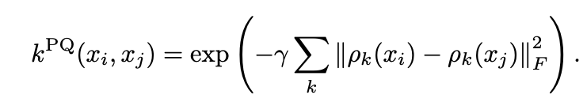

# Tool Reference

## 1. Experiment

### 1.1 Loading Past Experiments
The `Experiment` class allows loading past experiment logs to resume experiments from an intermediate point or to reproduce experiments conducted by others. While the next section will cover how to reproduce an experiment, this section introduces how to load past experiments.

- **Pattern 1: Loading Experiments You Conducted**
For experiments conducted in your local or cloud environment, you can load them by specifying the `experiment.json` log file generated by QXMT. If the directory structure, such as the working directory, differs between the original experiment and the current environment, it will automatically update to the current execution directory.

Once loaded, resuming the experiment using the `run` method will assign a consecutive run ID, allowing the experiment to be managed as part of a sequence.

``` python
import qxmt

experiment_path = "/your_project/experiments/your_experiment/experiment.json"
experiment = qxmt.Experiment().load(experiment_path)
```

- **Pattern 2: Loading Experiments Conducted by Others**
If the environment where the experiment was conducted is accessible, such as a shared server or cloud storage, you can load it in the same way as in Pattern 1. Ensure that the path to the configuration file is correctly set, and if custom modules are used, make sure they are included in the Python execution path.

If the experiment was conducted in a different environment and is not directly accessible, you need to copy the target experiment's `experiments/your_experiment` folder (automatically generated and managed by QXMT) and any custom modules used into your local environment. After copying, the experiment can be loaded using the same procedure as before.

### 1.2 Experiment Reproduction
This section explains how to reproduce a specific `run_id` of an experiment currently managed by an `Experiment` instance or one loaded using the `load` method, and how to retrieve artifacts such as models generated by the reproduction process.

To reproduce a specific `run_id`, execute the `reproduce` method on an `Experiment` instance that has accumulated runs, as shown below. The reproduction process will execute the target experiment, and the success of the reproduction is determined by whether the final model accuracy matches the value recorded in the log.

For reproducing experiments conducted by others, ensure that the paths of custom modules specified in the configuration file are correct and that the Python execution path is appropriately set, especially when directory structures differ.

```python
reproduced_artifact, reproduced_result = experiment.reproduce(run_id=1, check_commit_id=True)
```

Configurable Parameters
- **run_id**: The `run_id` of the experiment to be reproduced.
- **check_commit_id**: Set to `True` to verify the Git commit ID during reproduction.

If reproduction succeeds, two values are returned: `reproduced_artifact` and `reproduced_result`. These objects store datasets and models, similar to the execution of the run method. These can be retrieved or visualized as needed.

---

## 2. Dataset

### 2.1 Load Datasets with OpenML
In QXMT, the [OpenML](https://www.openml.org/) API can be utilized via a config file to simplify dataset preparation. This section explains the process from searching for the desired dataset to setting it up in the config file for use.

Let's assume you want to use the "Fashion-MNIST" dataset for an experiment. First, search for the relevant dataset on [OpenML's dataset search page](https://www.openml.org/search?type=data&sort=runs&status=active) and navigate to its detail page. On the detail page, you will be able to see information about the dataset, as shown below. From this information, take note of the "ID" and add it to the config (in this case, the ID is "40996").


Based on the information from the search, configure the Run settings in the config as shown below. (Only the necessary parts are extracted for clarity)

``` yaml
dataset:
  type: "openml"
  openml:
    name: "Fashion-MNIST"
    id: 40996
    return_format: "numpy"
    save_path: "data/openml/Fashion-MNIST/dataset.npz"
```

- **type**: Specifies the dataset type to be used in QXMT. Set this to `openml` when using a dataset from OpenML.
- **openml.name**: The name of the dataset on OpenML.
- **openml.id**: The ID of the dataset on OpenML.
- **openml.return_format**: Specifies the format of the dataset. It can be either pandas or numpy.
- **openml.save_path**: Specifies the path to save the downloaded dataset. If set to `null`, the dataset will not be saved.

Both `openml.name` and `openml.id` can be used individually. If only `openml.name` is specified, the dataset will be searched internally via the API. Since `openml.id` uniquely identifies the dataset, it is recommended to use this value. If both `openml.name` and `openml.id` are set, the value of `openml.id` will take precedence.

### 2.3 Chain Processing of Raw Processing Logic and Transform Logic
Not limited to the default logic provided by QXMT, users can also apply custom Raw Processing Logic and Transform Logic defined by themselves in a chain processing manner, where multiple processes are sequentially applied. In the configuration, the definition is done by listing each logic in order as a sequence.

In the example below, a process is defined that first applies `normalization` to the dataset, followed by dimensionality reduction using `dimension_reduction_by_pca`. There are several ways to represent lists in YAML, but as long as the syntax is permitted by YAML, any method can be used.

``` python
transform_logic:
- module_name: qxmt.datasets.transform.normalization
  implement_name: normalization
  params: null
- module_name: qxmt.datasets.transform.reduction_by_pca
  implement_name: dimension_reduction_by_pca
  params:
    n_components: 2
```

---

## 3. Device
### 3.1 Specifying the Simulator
In QXMT, simulators provided by various platforms can be specified and utilized through the configuration settings.
Several tutorials use `default.qubit`, the most basic simulator provided by PennyLane.

If computation time becomes a bottleneck in your experiments, consider using faster simulators such as `lightning.qubit`, which is implemented in C++, or `qulacs.simulator`, known for its high performance.

Below is an example of configuration settings for using `lightning.qubit`:
```
device:
  platform: "pennylane"
  name: "lightning.qubit"
  n_qubits: 2
  shots: null
```

When using these additional simulators, you may need to install the corresponding plugins in your environment.
For example, to use `lightning.qubit`, you can install the plugin with the following command:
`pip install pennylane-lightning`.

For other simulators available in PennyLane, refer to the [official documentation](https://pennylane.ai/plugins).

**Note:** QXMT has been validated and tested with frequently used simulators such as `default.qubit`, `lightning.qubit`, and `qulacs.simulator`. Therefore, some features of QXMT may not work with certain simulators. If you have requests for additional simulators, please feel free

### 3.2 Specifying the Simulation Execution Mode

There are two types of simulation execution modes: **State Vector** and **Sampling**.

In the **State Vector mode**, gates are applied as matrix operations on the state vector. Since the results are deterministic and directly obtained from the operations, this mode is ideal for ensuring reproducibility and performing functionality checks.

In the **Sampling mode**, sampling is performed based on the probability amplitudes obtained from the matrix operations to determine the final measurement results. While noise and other factors are not considered, this mode allows for simulation behavior closer to that of real quantum hardware.

In QXMT, the execution mode can be specified by configuring the `shots` value in the device's configuration.
The `shots` parameter represents the number of measurements, and as the value increases, the results converge toward those of the State Vector mode.

```
# State Vector形式
device:
  platform: "pennylane"
  name: "default.qubit"
  n_qubits: 2
  shots: null

# Sampling形式
device:
  platform: "pennylane"
  name: "default.qubit"
  n_qubits: 2
  shots: 1024
```

---

## 4. Feature Map

### 4.1 Visualization of Feature Map
This section introduces how to visualize the quantum circuit of the feature map you created. First, access the instance of the feature map you wish to visualize. There are two main ways to access the instance:

The first method involves obtaining the feature map instance through an artifact returned as the result of executing `run`.
``` python
artifact, result = experiment.run(config_source=adhoc_config)
feature_map = artifact.model.kernel.feature_map
```


The second method is to directly create an instance of the target feature map. This approach is useful when you want to experiment while referencing the circuit diagram, such as when creating a custom feature map.
``` python
from qxmt.feature_maps.pennylane.rotation import RotationFeatureMap
feature_map = RotationFeatureMap(2, 2, ["X", "Y"])
```

Once the feature map instance is obtained, you can visualize its quantum circuit using the `draw` method. PennyLane currently provides two visualization formats for quantum circuits: `default` and `mpl`. This section introduces the visualization results for both formats using the same circuit.

``` python
feature_map.draw(x_dim=2, format="default")
```
```
0: ─╭AngleEmbedding(M0)─╭AngleEmbedding(M0)─╭AngleEmbedding(M0)─╭AngleEmbedding(M0)─┤
1: ─╰AngleEmbedding(M0)─╰AngleEmbedding(M0)─╰AngleEmbedding(M0)─╰AngleEmbedding(M0)─┤
M0 =
[0.41553733 0.03790852]
```


``` python
feature_map.draw(x_dim=2, format="mpl")
```



When visualizing a feature map, it is necessary to provide sample information for the input data by specifying either the `x` or `x_dim` argument.

- The x argument should be set to a single sample value from the input data (e.g., `x_train[0]`).
- Alternatively, if using `x_dim`, specify the dimensionality of the input data. In this case, random data corresponding to the specified dimensionality will be generated and used for visualizing the quantum circuit.

These values are used solely as sample data during quantum circuit visualization and do not affect the results of experiments such as model construction.


### 4.2 Using NPQC
Here, we introduce the configuration settings for using `NPQC` as proposed in Reference [[1]](#ref1).

NPQC is defined using the following quantum circuit, which repeatedly encodes input data into qubits. This approach allows handling data with an input dimensionality exceeding the number of qubits used.



Settings related to the feature map are managed collectively under the `feature_map` section in the configuration. Here, you can specify the type of feature map and its parameters. To use NPQCFeatureMap, configure as follows. Note that the device settings are omitted in the example below, but keep in mind that the number of qubits in the quantum circuit must be even when using NPQC.

```yaml
feature_map:
  module_name: "qxmt.feature_maps.pennylane"
  implement_name: "NPQCFeatureMap"
  params:
    c: 1.0
    reps: 2
```

- **module_name**: The name of the module where the feature map is implemented (specified as above since it uses the implementation provided by QXMT).
- **implement_name**: The name of the class that implements the feature map (specified as above since it uses the implementation provided by QXMT).
- **params.c**: The scale parameter used in the feature map.
- **params.reps**: The number of repetitions in the feature map.

### 4.3 Using YZCX
Here, we introduce the configuration settings for using `YZCX` as proposed in Reference [[1]](#ref1).

YZCX is defined using the following quantum circuit, and like NPQC, it can handle data with an input dimensionality exceeding the number of qubits used.



To use YZCXFeatureMap, configure as follows:
```yaml
feature_map:
  module_name: "qxmt.feature_maps.pennylane"
  implement_name: "YZCXFeatureMap"
  params:
    c: 1.0
    reps: 2
    seed: 42
```

- **module_name**: The name of the module where the feature map is implemented (specified as above since it uses the implementation provided by QXMT).
- **implement_name**: The name of the class that implements the feature map (specified as above since it uses the implementation provided by QXMT).
- **params.c**: The scale parameter used in the feature map.
- **params.reps**: The number of repetitions in the feature map.
- **params.seed**: The seed for the random numbers applied to rotation angles.

---

## 5. Kernel

### 5.1 Using Projected Kernel
In kernel-based machine learning models, such as QSVC, there are various algorithms available for kernel computation. This section explains how to configure the settings when using the `Projected Kernel` ([[2]](#ref2)).

A simple Projected Kernel is expressed by the following equation, where the scale parameter `γ` and the method of projecting quantum states into classical states can be specified for distance computation.



*Source: Equation (9) from [“Power of data in quantum machine learning” [2]](#ref2)*

The kernel-related settings are managed collectively under the `kernel` section in the config file. Here, you can specify the type of kernel to use and its parameters. To use the Projected Kernel, configure the settings in the config file as follows.

``` yaml
kernel:
  module_name: "qxmt.kernels.pennylane"
  implement_name: "ProjectedKernel"
  params:
    gamma: 1.0
    projection: "z"
```

- **module_name**: Specifies the name of the module where the kernel method is implemented. In this case, use the one provided by QXMT as indicated above.
- **implement_name**: Specifies the class name that implements the kernel method. In this case, use the one provided by QXMT as indicated above.
- **params.gamma**: The scale parameter for kernel computation.
- **params.projection**: The method for projecting quantum states into classical states (available options are "x", "y" and "z").

---

## 6. Model

### 6.1 Model Evaluation via Cross Validation

If you want to evaluate the performance of the implemented quantum machine learning model using Cross Validation, you can configure and run it as follows. No additional settings are required in the config file for performing Cross Validation. The results of the execution are returned as a list that contains the evaluation results of each split.

``` python
# Obtain the model and dataset instances from the artifact returned by experiment.run
model = artifact.model
dataset = artifact.dataset

# In the example below, we perform evaluation by splitting the dataset originally prepared as "Train" into 5 folds
model.cross_val_score(X=dataset.X_train, y=dataset.y_train, cv=5)

>> [0.444643  0.535290 0.423356 0.551298 0.673212]
```

- **X**: Explanatory variables of the dataset to be split
- **y**: Objective variables of the dataset to be split
- **cv**: Number of splits for the dataset

QXMT’s Cross Validation internally executes scikit-learn’s `cross_val_score`. Therefore, you can also configure the other parameters described in the scikit-learn [documentation](https://scikit-learn.org/stable/modules/generated/sklearn.model_selection.cross_val_score.html). One commonly used parameter is `scoring`, which allows you to set the evaluation metric. By default, the model-specific default metric defined by scikit-learn is used (for SVC, this is accuracy). If you want to use a custom metric, refer to the [String name scorers](https://scikit-learn.org/stable/modules/model_evaluation.html#string-name-scorers).


### 6.2 Hyperparameter Search for Machine Learning Models

This section introduces how to perform hyperparameter search for machine learning models. No additional settings are required in the config file. The results of the search are returned as a dictionary containing the values of the discovered parameters. Additionally, by setting the `refit` parameter to `True` during the search, you can obtain the trained model using the pa

``` python
from sklearn.metrics import accuracy_score

# Obtain the model and dataset instances from the artifact returned by experiment.run
model = artifact.model
dataset = artifact.dataset

# Configure the search space and conditions
search_space = {
    'C': [0.1, 1.0],
    'gamma': [0.01, 0.1]
}
search_args = {
    'cv': 5,
    "direction": "maximize",
    'n_jobs': -1,
    'verbose': 2,
    "n_trials": 5,
}

# Perform the hyperparameter search
best_params = model.hyperparameter_search(
    X=dataset.X_train,
    y=dataset.y_train,
    sampler_type="tpe",
    search_space=search_space,
    search_args=search_args,
    objective=None,
    refit=True
)

# Evaluate the search results
pred = model.predict(dataset.X_test)
answer = dataset.y_test
score = accuracy_score(pred, answer)
print(f"Best Parameters: {best_params}")
print(f"Accuracy: {score}")
```

- **X**: Explanatory variables of the dataset
- **y**: Objective variables of the dataset
- **sampler_type**: Algorithm used for the search
  - `grid`: Grid Sampler
  - `random`: Random Sampler
  - `tpe`: TPE Sampler by [Optuna](https://github.com/optuna/optuna)
- **search_space**: Parameters and their search ranges
- **search_args**: Settings for the search
- **objective**: Objective function used during the search (if None, the default metric defined in the model is used. For details: String name scorers)
- **refit**: Whether to train the model with the parameters found during the search (True/False)

---

## Reference
<a id="ref1"></a>[1] Tobias Haug, Chris N. Self, M. S. Kim, “Quantum machine learning of large datasets using randomized measurements”, [Arxiv (2021)](https://arxiv.org/abs/2108.01039)

<a id="ref2"></a>[2] Hsin-Yuan Huang, Michael Broughton, Masoud Mohseni, Ryan Babbush, Sergio Boixo, Hartmut Neven, and Jarrod R McClean, “Power of data in quantum machine learning”, [Nature Communications 12, 1–9 (2021)](https://www.nature.com/articles/s41467-021-22539-9).

---

**Version Information**

| Environment | Version |
|----------|----------|
| document | 2024/12/14 |
| QXMT| v0.3.7 |
