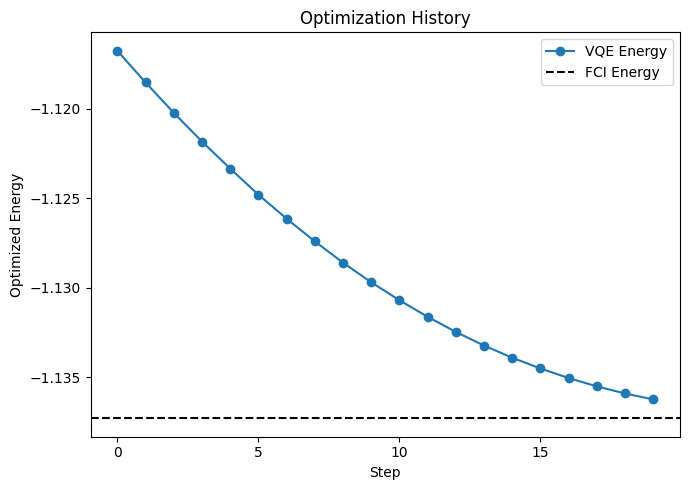

# Using the VQE Module for Quantum Chemistry Calculations

In this tutorial, you will learn how to use QXMT's Variational Quantum Eigensolver (VQE) module for quantum chemistry calculations. VQE is a hybrid quantum-classical algorithm designed to find the ground state energy of molecules, which is a fundamental problem in quantum chemistry.

## 1. VQE Configuration

QXMT's VQE module requires specific configuration elements that differ from the quantum kernel models. Here's an overview of the key components:

- **global_settings**:
  - `random_seed`: Sets a seed for reproducibility
  - `model_type`: Must be set to "vqe" to use the VQE module

- **hamiltonian**:
  - `module_name`: Module containing the Hamiltonian implementation
  - `implement_name`: Class name of the Hamiltonian implementation
  - `params`: Parameters for the Hamiltonian, such as molecule specification

- **device**:
  - `platform`: Currently supports "pennylane"
  - `device_name`: Device to use (e.g., "lightning.qubit")
  - `n_qubits`: Number of qubits required for the simulation
  - `shots`: Number of measurement shots (null for exact simulation)

- **ansatz**:
  - `module_name`: Module containing the ansatz implementation
  - `implement_name`: Class name of the ansatz implementation
  - `params`: Parameters for the ansatz

- **model**:
  - `name`: Model implementation (currently "basic")
  - `diff_method`: Differentiation method for optimization (e.g., "adjoint")
  - `optimizer_settings`: Optimizer settings. The type of optimizer can be specified using the `name` value, which can be any optimizer available in PennyLane or SciPy (detailed in [6.3 Optimizer Settings](./tool_reference.md#63-optimizer-settings)).
  - `params`: Additional parameters like maximum iterations

- **evaluation**:
  - `default_metrics`: Metrics like "final_cost" and "hf_energy"
  - `custom_metrics`: Any custom metrics to be calculated

## 2. Example Configuration for H2 Molecule

Below is an example configuration for calculating the ground state energy of an H2 molecule.
There are two methods of configuration. The first method is to directly specify the molecule name.

```yaml
description: "VQE calculation for H2 molecule"

global_settings:
  random_seed: 42
  model_type: "vqe"

hamiltonian:
  module_name: "qxmt.hamiltonians.pennylane"
  implement_name: "MolecularHamiltonian"
  params:
    molname: "H2"
    basis_name: "STO-3G"
    bondlength: 0.74
    active_electrons: 2
    active_orbitals: 2

device:
  platform: "pennylane"
  device_name: "lightning.qubit"
  n_qubits: 4
  shots: null
  random_seed: 42

ansatz:
  module_name: "qxmt.ansatze.pennylane"
  implement_name: "UCCSDAnsatz"
  params: null

model:
  name: "basic"
  diff_method: "adjoint"
  optimizer_settings:
    name: "Adam"
    params:
      stepsize: 0.01
      beta1: 0.9
      beta2: 0.999
  params:
    max_steps: 20
    verbose: false

evaluation:
  default_metrics:
  - "final_cost"
  - "hf_energy"
  - "fci_energy"
  custom_metrics: []
```

The second method is to explicitly specify the molecular structure. Please note that in this method, the FCI Energy value is currently not supported, so the evaluation results will show `fci_energy=None`.

```yaml
hamiltonian:
  module_name: "qxmt.hamiltonians.pennylane"
  implement_name: "MolecularHamiltonian"
  params:
    symbols: ["H", "H"]
    coordinates: [[0.0, 0.0, 0.0], [0.0, 0.0, 0.74]]
    charge: 0
    multi: 1
    basis_name: "STO-3G"
    active_electrons: 2
    active_orbitals: 2
    unit: "angstrom"
```

## 3. Running a VQE Calculation

To run a VQE calculation, you can use the same experiment framework as with quantum kernel models:

```python
import qxmt
from qxmt.experiment.schema import VQEEvaluations
from typing import cast

# Initialize experiment
experiment = qxmt.Experiment(
    name="vqe_h2_experiment",
    desc="VQE calculation for H2 molecule",
    auto_gen_mode=False,
).init()

# Run the experiment with the VQE configuration
config_path = "../configs/vqe_h2.yaml"
artifact, result = experiment.run(config_source=config_path)

# Access the results
final_energy = cast(VQEEvaluations, result.evaluations).optimized["final_cost"]
hf_energy = cast(VQEEvaluations, result.evaluations).optimized["hf_energy"]
fci_energy = cast(VQEEvaluations, result.evaluations).optimized["fci_energy"]
print(f"VQE Energy: {final_energy}")
print(f"HF Energy: {hf_energy}")
print(f"FCI Energy: {fci_energy}")
# output
# Optimizing ansatz with 3 parameters through 20 steps
# Optimization finished. Final cost: -1.13622722
# VQE Energy: -1.1362272195288956
# HF Energy: -1.11675922817382
# FCI Energy: -1.1372838216460408
```

```python
experiment.runs_to_dataframe()
# output
#   run_id	final_cost	hf_energy	fci_energy
# 0	1	-1.136227	-1.116759	-1.137284
```

## 4. Visualizing Optimization History

QXMT provides functionality to visualize the optimization progress during VQE calculations. You can plot the energy convergence as follows:

```python
from qxmt.visualization import plot_optimization_history
from qxmt.models.vqe import BaseVQE

# Plot the optimization history
plot_optimization_history(
    cost_history=cast(BaseVQE, artifact.model).cost_history,
    cost_label="VQE Energy",
    baseline_cost=fci_energy,
    baseline_label="FCI Energy",
    y_label="Optimized Energy",
    save_path=experiment.experiment_dirc / f"run_{experiment.current_run_id}/optimization.png"
)
```




This will generate a plot showing how the energy converges during the optimization process, helping you assess the quality of your VQE calculation.

---

**Version Information**

| Environment | Version |
|----------|----------|
| document | 2025/05/09 |
| QXMT| v0.5.0 |
