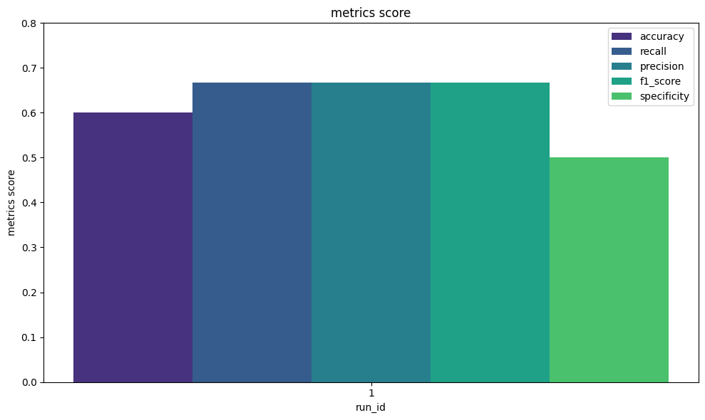

# 量子カーネルモデルのためのカスタム機能とMNISTデータセットを使用した実践的な例

このチュートリアルでは、MNISTデータセットを使用したより実践的な例として、量子カーネルモデルのためのカスタム機能を紹介します。QXMTを初めて使用する場合は、全体的な理解を得るために「[デフォルトのデータセットと量子カーネルモデルのみを使用した簡単な例](./qkernel_simple.md)」チュートリアルから始めることをお勧めします。

## 1. データセットの準備
実験の管理を開始するには、MNISTデータセットをダウンロードする必要があります。MNISTを含む主要なデータセットは、`scikit-learn`の[fetch_openml](https://scikit-learn.org/stable/modules/generated/sklearn.datasets.fetch_openml.html)メソッドを使用して簡単にダウンロードできます。

このチュートリアルでは、実験に使用するデータセットを手動でダウンロードしますが、QXMTは設定ファイルを介して[OpenML](https://www.openml.org/)から主要なデータセットをダウンロードする機能も提供しています。詳細については、OpenMLの使用方法を示すチュートリアルを参照してください。

``` python
import numpy as np
from sklearn import datasets

# Load MNIST784 dataset
digits_dataset = datasets.fetch_openml("mnist_784")
print(f"Dataset Shape: {digits_dataset.data.shape}")
print(f"Unique Label Number: {len(np.unique(digits_dataset.target))}")

# output
# Dataset Shape: (70000, 784)
# Unique Label Number: 10

# convert to numpy array
X = digits_dataset.data.to_numpy()
y = digits_dataset.target.to_numpy()

# save dataset on local environment
np.save("../data/mnist_784/dataset_X.npy", X)
np.save("../data/mnist_784/dataset_y.npy", y)
```

## 2. カスタム機能の実装

QXMTでは、以下の5つのカテゴリでカスタム機能を定義できます：

- **Dataset**：ロードされたデータセットからのフィルタリングや外れ値の除去のための前処理ロジック（`raw_preprocess_logic`）と、離散化や次元削減などのタスクのための変換ロジック（`transform_logic`）を定義できます。
- **Feature Map**：カスタム特徴マップを関数または量子回路として定義できます。
- **Kernel**：カスタムカーネル関数を定義できます。
- **Model**：カスタム量子機械学習モデルを定義できます。
- **Evaluation**：カスタム評価指標を定義し、各実験のログとして追跡できます。

このチュートリアルでは、一般的に使用される3つの機能：`Dataset`、`Feature Map`、および`Evaluation`を使用して、QXMTで実験を実装および管理する方法を示します。他の機能も同様に実装、呼び出し、管理できるため、それらのオプションをさらに探索することができます。

### 2.1 データセット処理ロジックのカスタム定義
データセットについては、前処理ロジックと変換ロジックの2種類のロジックを独立して定義できます。

まず、前処理ロジックの実装に取り組みます。これには、10クラス全体から特定のラベルに焦点を当てるためのMNISTデータセットのフィルタリングが含まれます。さらに、量子カーネルの計算複雑性が大きいため、データのサンプルサイズを削減する機能も含まれています。

``` python
# File: your_project/custom/raw_preprocess_logic.py

import numpy as np


def sampling_by_each_class(
    X: np.ndarray, y: np.ndarray, n_samples: int, labels: list[int]
) -> tuple[np.ndarray, np.ndarray]:

    y = np.array([int(label) for label in y])
    indices = np.where(np.isin(y, labels))[0]
    X, y = X[indices][:n_samples], y[indices][:n_samples]

    return X, y
```

次に、データの変換ロジックを実装します。このステップでは、PCAを使用して入力データの次元削減を行います。各MNIST画像は784次元で構成されているため、必要な量子ビット数が膨大になる可能性があります。したがって、使用するコンピューティング環境に基づいて、`n_components`パラメータを使用してデータを管理可能なサイズに圧縮します。

``` python
# File: your_project/custom/transform_logic.py

from typing import Optional

import numpy as np
from sklearn.decomposition import PCA
from sklearn.preprocessing import StandardScaler


def dimension_reduction_by_pca(
    X_train: np.ndarray,
    y_train: np.ndarray,
    X_val: Optional[np.ndarray],
    y_val: Optional[np.ndarray],
    X_test: np.ndarray,
    y_test: np.ndarray,
    n_components: int,
) -> tuple[np.ndarray, np.ndarray, Optional[np.ndarray], Optional[np.ndarray], np.ndarray, np.ndarray]:
    scaler = StandardScaler()
    scaler.fit(X_train)
    X_train_scaled = scaler.transform(X_train)
    X_val_scaled = scaler.transform(X_val) if X_val is not None else None
    X_test_scaled = scaler.transform(X_test)

    pca = PCA(n_components=n_components)
    pca.fit(X_train_scaled)
    X_train_pca = pca.transform(X_train_scaled)
    X_val_pca = pca.transform(X_val_scaled) if X_val_scaled is not None else None
    X_test_pca = pca.transform(X_test_scaled)

    return X_train_pca, y_train, X_val_pca, y_val, X_test_pca, y_test
```

### 2.2 特徴マップのカスタム定義

QXMTは、回転ゲートやZZFeatureMapなどの基本的な特徴マップを提供しており、設定で指定するだけで直接使用できます。ただし、実際のアプリケーションや研究では、より複雑な特徴マップが必要になることがよくあります。そのため、QXMTでは、設定を介して呼び出すことができるカスタム特徴マップの実装を可能にしています。このアプローチにより、さまざまな特徴マップデザインを実験しやすくなります。

このチュートリアルでは、ZZFeatureMapに続いてXXFeatureMapを適用する特徴マップとして、PennyLaneを使用した量子回路を実装します。カスタム特徴マップを定義する際は、互換性を確保し、QXMTのさまざまな機能を活用するために、抽象クラス`qxmt.feature_maps.BaseFeatureMap`を継承することが重要です。各特徴マップにクラスを作成するのが面倒な場合は、FeatureMapを実装する関数をKernelクラスに渡すこともできます。詳細については、APIリファレンスを参照してください。

``` python
# File: your_project/custom/feature_map.py

import numpy as np
import pennylane as qml

from qxmt.feature_maps import BaseFeatureMap


class CustomFeatureMap(BaseFeatureMap):
    def __init__(self, n_qubits: int, reps: int) -> None:
        super().__init__("pennylane", n_qubits)
        self.reps: int = reps

    def feature_map(self, x: np.ndarray) -> None:
        for _ in range(self.reps):
            for i in range(self.n_qubits):
                qml.Hadamard(wires=i)
                qml.RZ(x[i], wires=i)
            for i in range(0, self.n_qubits - 1):
                qml.IsingZZ(2 * (np.pi - x[i]) * (np.pi - x[i + 1]), wires=[i, i + 1])

        for _ in range(self.reps):
            for i in range(self.n_qubits):
                qml.RX(x[i], wires=i)
            for i in range(0, self.n_qubits - 1):
                qml.IsingXX(2 * (np.pi - x[i]) * (np.pi - x[i + 1]), wires=[i, i + 1])
```

### 2.3 評価指標のカスタム定義

このセクションでは、カスタム評価指標を定義します。精度、適合率、再現率、F値などのデフォルトの指標が提供されていますが、特定の目標に応じて追加の評価指標が必要になることがよくあります。そのような場合、ここで紹介する方法を使用して、デフォルトの指標と同じ方法で実験を管理できます。

このチュートリアルでは、追加の評価指標として特異度を定義します。カスタム評価指標を定義する場合は、`qxmt.evaluation.BaseMetric`を継承するクラスとして実装し、評価値を計算するロジックを`evaluate`メソッドに実装する必要があります。

``` python
# File: your_project/custom/evaluation.py

from typing import Any

import numpy as np
from sklearn.metrics import confusion_matrix

from qxmt.evaluation.metrics import BaseMetric


class CustomMetric(BaseMetric):
    def __init__(self) -> None:
        super().__init__("specificity")

    @staticmethod
    def evaluate(actual: np.ndarray, predicted: np.ndarray, **kwargs: Any) -> float:
        tn, fp, fn, tp = confusion_matrix(actual, predicted).ravel()
        return tn / (tn + fp)
```

データセット、特徴マップ、および評価指標のカスタムロジックの実装が完了しました。実装されたロジックはさまざまなパラメータを受け入れることができ、Runの設定を通じて設定できるため、異なる条件下で実験を簡単に実行できます。詳細は第3章で紹介します。

## 3. 実行設定の構成

このセクションでは、実装されたカスタムメソッドを利用するために設定ファイルで構成する必要がある項目について説明します。追加の設定が必要な領域は`[SETUP]`タグでマークされています。主な設定方法は、カスタムロジックが実装されているモジュールへのパスと、関数またはクラス名を指定することです。各パラメータは`params`の下に文書化することもでき、実行中に引数として渡すことができます。

```yaml
# File: your_project/configs/custom.yaml

description: "Configuration file for the custom MNIST case"

global_settings:
  random_seed: &global_seed 42
  model_type: "qkernel"
  task_type: "classification"

dataset:
  file: # [SETUP] full path or relative path from the root of the project
    data_path: "data/mnist_784/dataset_X.npy"
    label_path: "data/mnist_784/dataset_y.npy"
    label_name: null
  split:
    train_ratio: 0.8
    validation_ratio: 0.0
    test_ratio: 0.2
    shuffle: true
  features: null
  raw_preprocess_logic: # [SETUP] your logic path and parameter
    module_name: "your_project.custom.raw_preprocess_logic"
    implement_name: "sampling_by_each_class"
    params:
        n_samples: 100
        labels: [0, 1]
  transform_logic: # [SETUP] your logic path and parameter
    module_name: "your_project.custom.transform_logic"
    implement_name: "dimension_reduction_by_pca"
    params:
        n_components: 2

device:
  platform: "pennylane"
  device_name: "default.qubit"
  n_qubits: 2
  shots: null

feature_map: # [SETUP] your logic path and parameter
  module_name: "your_project.custom.feature_map"
  implement_name: "CustomFeatureMap"
  params:
    reps: 2

kernel:
  module_name: "qxmt.kernels.pennylane"
  implement_name: "FidelityKernel"
  params: {}

model:
  name: "qsvc"
  params:
    C: 1.0
    gamma: 0.05

evaluation: # [SETUP] your logic path
  default_metrics:
  - "accuracy"
  - "precision"
  - "recall"
  - "f1_score"
  custom_metrics:
  - {"module_name": "your_project.custom.evaluation", "implement_name": "CustomMetric"}
```

## 4. 実験の実行と評価
最後に、QXMT実験管理システムのインスタンスを作成し、前に定義した設定ファイルを使用してRunを実行します。

実行中にモジュールインポートエラーが発生した場合は、Pythonパスを確認して処理を再実行してください。
例えば、カスタムモジュールが`/root/hoge/your_project/custom/raw_preprocess_logic.py`に実装されている場合、`sys.path.append("/root/hoge")`コマンドを使用してPythonパスを更新できます。


``` python
import qxmt

# initialize experiment for custom tutorial
experiment = qxmt.Experiment(
    name="custom_tutorial",
    desc="A custom experiment for MNIST dataset",
    auto_gen_mode=False,
).init()

# execute run of custom method
config_path = "../configs/custom.yaml"
artifact, result = experiment.run(config_source=config_path)

# check evaluation result
metrics_df = experiment.runs_to_dataframe()
metrics_df.head()
# output
#       run_id  accuracy  precision  recall  f1_score
#	run_id	accuracy	precision	recall	f1_score	specificity
# 0	     1	    0.6	         0.66	  0.66	    0.66	       0.5
```

カスタム定義された評価指標を含む実験結果が可視化されます。

``` python
from qxmt.visualization import plot_metrics_side_by_side

# get run result as dataframe
df = experiment.runs_to_dataframe()

# add your custom metrics on metrics list
plot_metrics_side_by_side(
  df=df,
  metrics=["accuracy", "recall", "precision", "f1_score", "specificity"],
  run_ids=[1],
  save_path=experiment.experiment_dirc / "side_by_side.png"
  )
```


---

**バージョン情報**

| 環境 | バージョン |
|----------|----------|
| ドキュメント | 2025/05/12 |
| QXMT| v0.5.1 |
