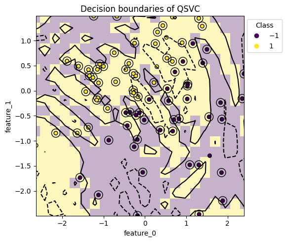

# デフォルトのデータセットと量子カーネルモデルのみを使用した簡単な例

このチュートリアルでは、QXMTのデフォルト機能を使用して量子カーネルモデルによる量子機械学習の実験を管理する方法を学びます。QXMTは、一般的に使用されるデータセット、前処理方法、量子機械学習モデル、および評価指標をデフォルト機能として提供しています。これらの組み込み機能を活用することで、実験の初期段階でベースラインを効率的に確立できます。

QXMTは以下のディレクトリ構造で実験を管理します：

- **data**：実験で使用されるrawデータ
- **config**：各実験実行の設定を定義するYAMLファイル
- **experiments**：プログラムによって段階的に保存される実験の情報と結果を保存。各フォルダは実験の名前（後述）によって整理され、実際の実行結果を保存する個々の「run」フォルダを含みます。


``` bash
<your_project>
├── data
├── configs
│   ├── config_1.yaml
│   ├──   ⋮
│   └── config_n.yaml
└── experiments
    ├── <your_experiment_1>
    │   ├── experiment.json
    │   ├── run_1
    │   │   ├── config.yaml
    │   │   ├── shots.h5
    │   │   └── model.pkl
    │   ├── run_2
    │   ├──   ⋮
    │   └── run_n
    │   ⋮
    └── <your_experiment_n>
```


## 1. 実験の設定
まず、pipでインストールしたパッケージをインポートします。次に、`Experiment`インスタンスを作成して実験全体を管理し、`init()`メソッドを使用して初期化します。`Experiment`クラスでは複数のメンバ変数を指定できますが、ここでは基本的な3つを設定します。それぞれの役割は以下の通りです：

- **name**：実験の名前を設定します。この名前に基づいて、カレントワーキングディレクトリに`experiments/{name}`ディレクトリが作成されます。
- **desc**：実験の簡単な説明を追加するための自由テキストフィールドです。処理には使用されず、文字列であること以外に制限はありません。後で実験を確認する際に関連情報を記録するためにこのフィールドを使用してください。
- **auto_gen_mode**：LLMを使用して各実行の説明を自動生成する機能を有効または無効にするフラグです（デフォルトは`False`）。この機能を使用したい場合は、パッケージをインストールする際に`pip install qxmt[llm]`を実行し、環境変数`USE_LLM`を`True`に設定してください。

``` python
import qxmt

experiment = qxmt.Experiment(
    name="simple_tutorial",
    desc="QXMTライブラリの動作を確認するための簡単な実験",
    auto_gen_mode=False,
).init()
```

ここまでで、QXMTを使用した実験管理の設定が完了しました。

## 2. 実行設定
QXMTでは、各実験試行は「Run」と呼ばれる単位として管理されます。Runを設定するには、データセットやモデルなどのインスタンスを`experiment.run()`メソッドに直接渡す方法と、YAML設定ファイルを使用する方法の2つがあります。インスタンスベースの方法はシンプルなため、アドホックな検証には便利ですが、より構造化された実験管理、特に研究では、より機能豊富な設定ベースの方法をお勧めします。

ここでは、今回のチュートリアルで利用するconfigファイルをもとに各設定項目について説明します。

- **description**: Runに対しての説明を記載します。上記「1. 実験の設定」で記載したdescriptionは実験全体に対しての説明であり、今回はrunに対する説明となります。こちらの値を空文字列とし、`auto_gen_mode=True`に設定するとLLMで自動生成したdescriptionが設定されます。
- **dataset**: runで利用するデータセットを指定します。`type`には"file"、"generate"、"openml"があり、"file"を指定した場合には自身で用意したデータセットを利用し、"generate"が指定された場合はダミーデータが生成され、"openml"を指定して場合はOpenMLのAPIを利用して指定したデータセットのダウンロードを行います。今回のチュートリアルでは"generate"モードを利用しますが、より実践に近い"file"や"openml"モードについては別のチュートリアルで紹介しています。
- **global_settings**: グローバル設定パラメータを定義します：
  - `random_seed`: 再現性のためのシード値を設定します
  - `model_type`: 量子カーネルモデルを使用するには "qkernel" に設定する必要があります
  - `task_type`: 量子カーネルモデルの場合、タスクが "classification"（分類）か "regression"（回帰）かを指定します
- **device**: シミュレーションを実行する量子デバイスを設定します。現時点でconfig経由では`pennylane`のみ対応しています
- **feature_map**: 量子特徴マップを利用する場合には、その特徴マップが実装されているモジュール名 (`module_name`)とクラス名 (`implement_name`)を指定します。`params`内にdict形式で必要なパラメータを指定することができます。今回はデフォルトで用意されている特徴マップを利用します
- **kernel**: カーネルベースのモデルを利用する場合には、そのカーネルが実装されているモジュール名 (`module_name`)とクラス名 (`implement_name`)を指定します。`params`内にdict形式で必要なパラメータを指定することができます。今回はデフォルトで用意されているカーネルを利用します
- **model**: 利用する機械学習モデルとそのパラメータを指定します。量子カーネルモデルの場合、利用可能なオプションには "qsvc"（分類用）、"qsvr"（回帰用）、"qrigge"（回帰用）があります
- **evaluation**: デフォルトで用意されている評価指標のうち利用する指標名のリストを指定します

``` yaml
description: "Configuration file for the simple example"

global_settings:
  random_seed: &global_seed 42
  model_type: "qkernel"
  task_type: "classification"

dataset:
  generate:
    generate_method: "linear"
    params: {
      "n_samples": 100,
      "n_features": 2,
      "n_classes": 2,
    }
  split:
    train_ratio: 0.8
    validation_ratio: 0.0
    test_ratio: 0.2
    shuffle: true
  features: null
  raw_preprocess_logic: null
  transform_logic: null

device:
  platform: "pennylane"
  device_name: "default.qubit"
  n_qubits: 2
  shots: null

feature_map:
  module_name: "qxmt.feature_maps.pennylane"
  implement_name: "ZZFeatureMap"
  params:
    reps: 2

kernel:
  module_name: "qxmt.kernels.pennylane"
  implement_name: "FidelityKernel"
  params: {}

model:
  name: "qsvc"
  params:
    C: 1.0
    gamma: 0.05

evaluation:
  default_metrics:
  - "accuracy"
  - "precision"
  - "recall"
  - "f1_score"
  custom_metrics: []
```

## 3. 「Run」の実行
このステップでは、ステップ2で設定した「Run」(実験)を実行します。「Run」を実行するには、設定をファイルパスとして渡す方法と、インスタンスとして渡す方法の2つがあります。まず、ファイルパスを指定して実行する方法を示します。

``` python
config_path = "../configs/simple.yaml"

# input config file
artifact_1, result_1 = experiment.run(config_source=config_path)
```

Runを実行する際には、さまざまな追加引数を指定できますが、ここでは最もシンプルな方法を紹介します。Runが実行されると、`artifact`と`result`が返されます。`artifact`には、Runで使用されたデータセット（`artifact.dataset`）と機械学習モデル（`artifact.model`）が含まれます。`result`には、Run設定とモデル評価結果が含まれます。これらは、次の章で紹介する可視化や、その後のモデル開発中の分析に使用できます。

次に、設定をインスタンスとして渡してRunを実行する方法を示します。この方法は、モデルパラメータをその場で調整するのに便利であり、モデルの構造を探索する際に特に有益です。

``` python
from qxmt import ExperimentConfig

# load default config
adhoc_config = ExperimentConfig(path=config_path)

# update model paramter
adhoc_config.model.params.update(
    {"C": 0.5, "gamma": "scale"})

# input the updated config instance
artifact_2, result_2 = experiment.run(config_source=adhoc_config)
```

実行から得られた`artifact`と`result`は、設定ファイルから実行した場合と同じ形式になります。

各Runの結果は、以下のコードを実行することで、`evaluation.default_metrics`で指定された指標を含むDataFrameとして取得できます：

``` python
# extract the results as a pandas dataframe
metrics_df = experiment.runs_to_dataframe()

metrics_df.head()
# output
#       run_id  accuracy  precision  recall  f1_score
# 0          1	    0.75       0.66    0.75      0.70
# 1          2	    0.55       0.54    0.60      0.57
```


## 4. 結果の可視化
このセクションでは、Experimentによって管理される複数のRunの結果を可視化するためのいくつかの方法を紹介します。ここで紹介する手法に加えて、ライブラリはさまざまな他の可視化オプションを提供しています。APIリファレンスを参照し、目的に最も適した方法を使用してください。また、前章の`result`に格納されているRunの結果はDataFrameとして抽出できるため、独自の分析や可視化を行うことができます。

### 4.1 データセットのラベル分布の可視化
このセクションでは、作成したダミーデータセットのラベル分布を可視化します。これにより、トレーニングデータセットと評価データセットの間で分布に大きな偏りがあるかどうかを視覚的に確認できます。以下の例では、引数としてデータセットと保存パス（`save_path`）のみを指定していますが、グラフのタイトルなどの他のオプションも`kwargs`として渡すことができます。また、`save_path=None`を指定すると、グラフは保存されません。

``` python
from qxmt.visualization import plot_2d_dataset

# extract dataset instance from run artifact
dataset = artifact_1.dataset

plot_2d_dataset(
  dataset=dataset,
  save_path=experiment.experiment_dirc / f"run_{experiment.current_run_id}/dataset.png"
  )
```


### 4.2 評価指標の比較
このセクションでは、異なるパラメータやモデル構造で複数のRunが実行された場合に、評価指標を可視化して比較する方法を説明します。`plot_metrics_side_by_side`を使用すると、比較したい評価指標名のリスト（これらはDataFrameの列名に対応します）を渡すことで、X軸に各Runを配置した棒グラフを作成できます。また、この例では使用されていませんが、特定のRunに比較を絞りたい場合は、`run_ids=[1, 3, 5, 6]`のようなターゲット`run_ids`のリストを引数として渡すことができます。

``` python
from qxmt.visualization import plot_metrics_side_by_side

# get run result as dataframe
df = experiment.runs_to_dataframe()

plot_metrics_side_by_side(
  df=df,
  metrics=["accuracy", "recall", "precision", "f1_score"],
  run_ids=[1, 2],
  save_path=experiment.experiment_dirc / "side_by_side.png"
  )
```


### 4.3 モデルの決定境界
モデルとしてQuantum Support Vector Machine (QSVC)を利用している場合には、学習済みモデルの決定境界を可視化することができます。この可視化を活用することで、うまく分類できていない例を見つけたり、モデルの特徴を捉えるヒントを得ることができます。

引数に設定するモデルやデータセットについては、Runの`artifact`から取得することができます。`grid_resolution`は可視化する決定境界の解像度を設定することができ、高い値に設定するほど境界が滑らかになり、個々のサンプルについても分類結果を確認することができます。一方で計算時間が大幅に増加するため目的に合わせて調整してください。`support_vectors`はbool値を取り、出力するグラフのsupport vectorを◯印で囲って視認性を高めるかを制御することができます。

``` python
from qxmt.visualization import plot_2d_decision_boundaries

# extract model and dataset instance from run artifact
model = artifact_1.model
dataset = artifact_1.dataset

plot_2d_decision_boundaries(
  model=model,
  X=dataset.X_train,
  y=dataset.y_train,
  grid_resolution=30,
  support_vectors=True,
  save_path=experiment.experiment_dirc / f"run_{experiment.current_run_id}/boundary.png")
```



---

**バージョン情報**

| 環境 | バージョン |
|----------|----------|
| ドキュメント | 2025/05/12 |
| QXMT| v0.5.1 |
