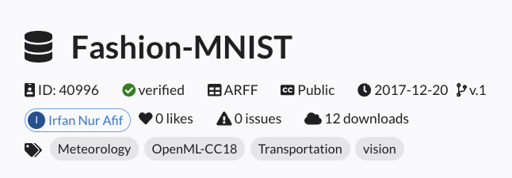

# ツールの機能リファレンス

## 1. Experiment

### 1.1. 過去の実験の読み込み
`Experiment`クラスでは過去の実験ログを読み込んで、途中から実験を再開したり、他の人の実験を再現実行することができます。
実験を再現する方法については次の章で扱うため、ここでは過去の実験を読み込む方法について紹介します。

- **パターン1: 自分で行った実験を読み込む場合**
自分のローカル環境やクラウド環境で行った実験については、以下のようにQXMTで生成されるログファイルである`experiment.json`を指定することで読み込むことができます。読み込んだ際にワーキングディレクトリ等のディレクトリ構成が読み込み元と異なる場合には自動的に現在の実行ディレクトリに更新されます。

読み込んだ後に`run`メソッドで実験を再開すると連続した連番がrun_idとして付与され、一連の実験として管理することができます。

``` python
import qxmt

experiment_path = "/your_project/experiments/your_experiment/experiment.json"
experiment = qxmt.Experiment().load(experiment_path)
```

- **パターン2: 他の人が行った実験を読み込む場合**
他の人が行った実験を読み込む場合、その環境が共有サーバや共有クラウド等アクセスできる状態にある場合にはパターン1と同様の方法で読み込むことができます。その際にconifgのパスを適切に設定すること、カスタムモジュールを利用している場合はPythonの実行パスを通す必要があることに注意が必要です。

もし、異なる環境で実験が行われており直接アクセスできない場合には対象の実験の`experiments/your_experiment`フォルダ (QXMTによって自動生成・管理されるフォルダ)とカスタムモジュールを利用している場合には該当コードを自分の環境にコピーしてくる必要があります。その後は、これまでと同様の手順で読み込むことが可能です。


### 1.2. 実験の再現
`Experiment`インスタンスで現在管理中の実験や`load`メソッドで読み込んだ実験の特定のrun_idに対して実験の再現を行い、その成果物であるモデル等を取得する方法を紹介します。

特定のrun_idの実験を再現する場合には、runがすでに蓄積されている`Experiment`インスタンスに対して以下のように`reproduce`メソッドを実行します。
すると、対象実験の再現実行が行われ最終的にモデルの精度がログに記載されている値と等しいかどうかで再現の成功有無を判定します。

他の人の実験を再現する場合など、ディレクトリ構成が異なる場合はconfigファイル内のカスタムモジュールのpathを再確認することとPythonの実行パスが通っていることを再度確認して下さい。

```python
reproduced_artifact, reproduced_result = experiment.reproduce(run_id=1, check_commit_id=True)
```

設定できるパラメータとして以下の2つがあります。
- **run_id**: 再現実行したい実験のrun_id
- **check_commit_id**: 再現時にgitのcommit idレベルでチェックを行いたい時は`True`に設定

再現に成功すると、`reproduced_artifact`と`reproduced_result`という二つの値が返されます。これらの値は、通常のrunメソッド実行時と同様にデータセットやモデルを格納したいインスタンスとなっており、必要に応じて取得や可視化を行うことができます。

---

## 2. Dataset

### 2.1OpenMLを用いたデータセットの読み込み
QXMTではデータセットの準備を簡略化するために[OpenML](https://www.openml.org/)のAPIをconfigファイル経由で利用できるようになっています。ここでは、利用したいデータセットを検索しconfigに設定して利用するまでの流れを紹介します。

実験で「Fashion-MNIST」のデータセットを利用したいとします。その場合は、まずOpenMLの[データセット検索ページ](https://www.openml.org/search?type=data&sort=runs&status=active)で利用し該当するデータセットを探し、詳細ページへ移動します。詳細ページに移動すると以下のようなデータセットの情報を確認することができます。この中の「ID」をconfigに記載します (今回の場合はID="40996")。



検索した情報を元にRunのconfigを以下のように設定します。(設定が必要な部分のみ抜粋)

``` yaml
dataset:
  type: "openml"
  openml:
    name: "Fashion-MNIST"
    id: 40996
    return_format: "numpy"
    save_path: "data/openml/Fashion-MNIST/dataset.npz"
```

- **type**: QXMTで利用するデータセットタイプを指定。OpenMLのデータセット利用する場合は`openml`と設定
- **openml.name**: OpenML上でのデータセット名
- **openml.id**: OpenML上でのデータセットのID
- **openml.return_format**: データセットのフォーマットを指定。pandasまたはnumpy形式を指定可能
- **openml.save_path**: ダウンロードしたデータセットを保存するパスを指定。`null`の場合は保存しない

`openml.name`と`openml.id`は、どちらか一方のみでも利用可能です。`openml.name`のみが設定された場合はAPIを使って内部で該当するデータセットが検索されます。`openml.id`は対象のデータセットを一意に特定することができるため、こちらの値を設定することを推奨しています。`openml.name`と`openml.id`の両方が設定された場合は`openml.id`の値が優先されます。

### 2.2 Raw Processing LogicとTransform LogicのChain処理
QXMTからデフォルトで提供されているLogicに限らず、ユーザが独自に定義したカスタムのRaw Processing LogicとTransform LogicについてもChain処理として、複数の処理を順に適用することが可能です。configでの定義方法は、各種ロジックをリスト形式で順に記載していきます。

以下の例では、データセットに対して`normalization`を行ったのち、`dimension_reduction_by_pca`で次元圧縮を行う処理を定義しています。
yamlにおけるリストの表記方法はいくつかパターンがありますが、yamlで許可されている記法であれば問題ありません。

``` python
transform_logic:
- module_name: qxmt.datasets.transform.normalization
  implement_name: normalization
  params: null
- module_name: qxmt.datasets.transform.reduction_by_pca
  implement_name: dimension_reduction_by_pca
  params:
    n_components: 2
```

---

## 3. Feature Map

### 3.1 Feature Mapの可視化
作成した特徴マップの量子回路を可視化する方法を紹介します。
まず、可視化したい特徴マップのインスタンスにアクセスします。インスタンスへは大きく二つの方法でアクセスする方法があります。

一つ目の方法は、`run`の実行結果として返ってくるArtifact経由で特徴マップのインスタンスを取得する方法です。
``` python
artifact, result = experiment.run(config_source=adhoc_config)
feature_map = artifact.model.kernel.feature_map
```

もう一つの方法は、対象の特徴マップのインスタンスを直接作成する方法です。この方法では、カスタムの特徴マップを作る場合に回路図を見ながら試行錯誤したいという場合に便利です。
``` python
from qxmt.feature_maps.pennylane.rotation import RotationFeatureMap
feature_map = RotationFeatureMap(2, 2, ["X", "Y"])
```

特徴マップのインスタンスが取得できると`draw`メソッドでその量子回路を可視化できます。
現在PennyLaneで作成した量子回路の可視化フォーマットとして、`default`と`mpl`の2種類が用意されています。
同一回路における、それぞれの可視化結果をここでは紹介します。

``` python
feature_map.draw(x_dim=2, format="default")
```
```
0: ─╭AngleEmbedding(M0)─╭AngleEmbedding(M0)─╭AngleEmbedding(M0)─╭AngleEmbedding(M0)─┤
1: ─╰AngleEmbedding(M0)─╰AngleEmbedding(M0)─╰AngleEmbedding(M0)─╰AngleEmbedding(M0)─┤
M0 =
[0.41553733 0.03790852]
```


``` python
feature_map.draw(x_dim=2, format="mpl")
```


特徴マップの可視化時には、入力データのサンプル情報を伝える必要があるため引数`x`または`x_dim`のどちらかを設定する必要があります。
- `x`は入力データの1つのサンプル値を設定します (例：`x_train[0]`など)
- `x_dim`を利用する場合には、入力データの次元数を設定します。すると、次元数に応じたランダムなデータが生成され、その値を元に量子回路の可視化が行われます。

これらの値は、量子回路可視化時にサンプルデータとして用いられるだけで、モデル構築等の実験の結果には影響しません。


### 3.2 NPQCの利用
ここでは、[参考文献[1]](#ref1)で提案された`NPQC`を利用する場合のconifg設定方法を紹介します。

NPQCは以下の量子回路で定義され、入力データをqubitに対して繰り返しエンコーディングしていくため、利用するqubit数以上の入力次元数を持つデータを扱うことができます。


特徴マップの関する設定は、config内の`feature_map`という項目で一括管理されています。こちらで利用する特徴マップの種類やパラメータを指定することができます。NPQCFeatureMapを利用したい場合は以下のようにconfigを設定します。以下のconifgではデバイスの設定項目を省略していますが、NPQCでは量子回路のqubit数を偶数にする必要がある点に注意して下さい。
```yaml
feature_map:
  module_name: "qxmt.feature_maps.pennylane"
  implement_name: "NPQCFeatureMap"
  params:
    c: 1.0
    reps: 2
```

- **module_name**: 特徴マップが実装されているモジュール名（今回はQXMTが提供しているものを利用するため上記のように記載）
- **implement_name**: 特徴マップを実装したクラス名（今回はQXMTが提供しているものを利用するため上記のように記載）
- **params.c**: 特徴マップで利用されるスケールパラメータ
- **params.reps**: 特徴マップの繰り返し数

### 3.3 YZCXの利用
ここでは、[参考文献[1]](#ref1)で提案された`YZCX`を利用する場合のconifg設定方法を紹介します。

YZCXは以下の量子回路で定義され、NPQCと同様に利用するqubit数以上の入力次元数を持つデータを扱うことができます。


YZCXFeatureMapを利用したい場合は以下のようにconfigを設定します。
```yaml
feature_map:
  module_name: "qxmt.feature_maps.pennylane"
  implement_name: "YZCXFeatureMap"
  params:
    c: 1.0
    reps: 2
    seed: 42
```

- **module_name**: 特徴マップが実装されているモジュール名（今回はQXMTが提供しているものを利用するため上記のように記載）
- **implement_name**: 特徴マップを実装したクラス名（今回はQXMTが提供しているものを利用するため上記のように記載）
- **params.c**: 特徴マップで利用されるスケールパラメータ
- **params.reps**: 特徴マップの繰り返し数
- **params.seed**: 回転角に適用する乱数のシード


---

## 4. Kernel

### 4.1 Projected Kernelの利用
QSVCに代表されるカーネル機械学習モデルでは、カーネルの計算アルゴリズムとして様々なものが存在します。ここでは[参考文献[2]](#ref2)で提案された`Projected Kernel`を利用する場合のconfigの設定方法を紹介します。

シンプルなProjected Kernelは以下の式で表され、スケールパラメータ`γ`と距離を計算するにあたり量子状態を古典状態に投影する方法を指定することができます。


*引用元: [“Power of data in quantum machine learning”[2]](#ref2)の式 (9)*


カーネルの関する設定は、config内の`kernel`という項目で一括管理されています。こちらで利用するカーネルの種類やパラメータを指定することができます。Projected Kernelを利用したい場合は以下のようにconfigを設定します。

``` yaml
kernel:
  module_name: "qxmt.kernels.pennylane"
  implement_name: "ProjectedKernel"
  params:
    gamma: 1.0
    projection: "z"
```

- **module_name**: カーネルメソッドが実装されているモジュール名（今回はQXMTが提供しているものを利用するため上記のように記載）
- **implement_name**: カーネルメソッドを実装したクラス名（今回はQXMTが提供しているものを利用するため上記のように記載）
- **params.gamma**: カーネル計算時のスケールパラメータ
- **params.projection**: 量子状態を古典状態へ投影する方法 ("x", "y", "z"が利用可能)

---

## Reference
<a id="ref1"></a>[1] Tobias Haug, Chris N. Self, M. S. Kim, “Quantum machine learning of large datasets using randomized measurements”, [Arxiv (2021)](https://arxiv.org/abs/2108.01039)
<a id="ref2"></a>[2] Hsin-Yuan Huang, Michael Broughton, Masoud Mohseni, Ryan Babbush, Sergio Boixo, Hartmut Neven, and Jarrod R McClean, “Power of data in quantum machine learning”, [Nature Communications 12, 1–9 (2021)](https://www.nature.com/articles/s41467-021-22539-9).

---

**バージョン情報**

| Environment | Version |
|----------|----------|
| document | 2024/11/15 |
| QXMT| v0.3.5 |
