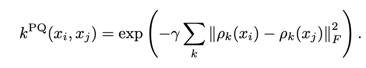

# ツールの機能リファレンス

## OpenMLを用いたデータセットの読み込み
QXMTではデータセットの準備を簡略化するために[OpenML](https://www.openml.org/)のAPIをconfigファイル経由で利用できるようになっています。ここでは、利用したいデータセットを検索しconfigに設定して利用するまでの流れを紹介します。

実験で「Fashion-MNIST」のデータセットを利用したいとします。その場合は、まずOpenMLの[データセット検索ページ](https://www.openml.org/search?type=data&sort=runs&status=active)で利用し該当するデータセットを探し、詳細ページへ移動します。詳細ページに移動すると以下のようなデータセットの情報を確認することができます。この中の「ID」をconfigに記載します (今回の場合はID="40996")。


検索した情報を元にRunのconfigを以下のように設定します。(設定が必要な部分のみ抜粋)

``` yaml
dataset:
  type: "openml"
  openml:
    name: "Fashion-MNIST"
    id: 40996
    return_format: "numpy"
    save_path: "data/openml/Fashion-MNIST/dataset.npz"
```

- **type**: QXMTで利用するデータセットタイプを指定。OpenMLのデータセット利用する場合は`openml`と設定
- **openml.name**: OpenML上でのデータセット名
- **openml.id**: OpenML上でのデータセットのID
- **openml.return_format**: データセットのフォーマットを指定。pandasまたはnumpy形式を指定可能
- **openml.save_path**: ダウンロードしたデータセットを保存するパスを指定。`null`の場合は保存しない

`openml.name`と`openml.id`は、どちらか一方のみでも利用可能です。`openml.name`のみが設定された場合はAPIを使って内部で該当するデータセットが検索されます。`openml.id`は対象のデータセットを一意に特定することができるため、こちらの値を設定することを推奨しています。`openml.name`と`openml.id`の両方が設定された場合は`openml.id`の値が優先されます。


## Projected Kernelの利用
QSVCに代表されるカーネル機械学習モデルでは、カーネルの計算アルゴリズムとして様々なものが存在します。ここでは`Projected Kernel`[1]を利用する場合のconfigの設定方法を紹介します。

シンプルなProjected Kernelは以下の式で表され、スケールパラメータ`γ`と距離を計算するにあたり量子状態を古典状態に投影する方法を指定することができます。



*引用元: “Power of data in quantum machine learning,”[1]の式 (9)*


カーネルの関する設定は、config内の`kernel`という項目で一括管理されています。こちらで利用するカーネルの種類やパラメータを指定することができます。Projected Kernelを利用したい場合は以下のようにconfigを設定します。

``` yaml
kernel:
  module_name: "qxmt.kernels.pennylane"
  implement_name: "ProjectedKernel"
  params:
    gamma: 1.0
    projection: "xyz_sum"
```

- **module_name**: カーネルメソッドが実装されているモジュール名を指定します。今回はQXMTが提供しているものを利用するため上記のように記載します。
- **implement_name**: カーネルメソッドを実装したクラス名を指定します。今回はQXMTが提供しているものを利用するため上記のように記載します。
- **params.gamma**: カーネル計算時のスケールパラメータ
- **params.projection**: 量子状態を古典状態へ投影する方法 ("x", "y", "z", "xyz", "xyz_sum"が利用可能)

[1] Hsin-Yuan Huang, Michael Broughton, Masoud Mohseni, Ryan Babbush, Sergio Boixo, Hartmut Neven, and Jarrod R McClean, “Power of data in quantum machine learning,” [Nature Communications 12, 1–9 (2021)](https://www.nature.com/articles/s41467-021-22539-9).

---

### バージョン情報
| Environment | Version |
|----------|----------|
| document | 2024/10/10 |
| QXMT| v0.2.3 |
