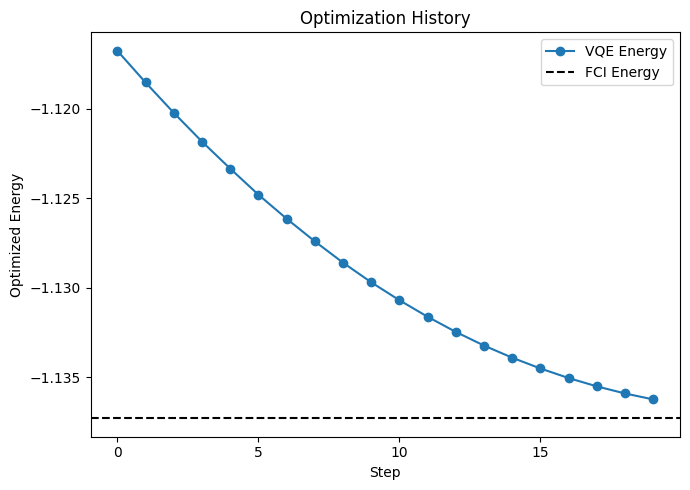

# 量子化学計算のためのVQEモジュールの使用方法

このチュートリアルでは、量子化学計算のためのQXMTのVariational Quantum Eigensolver (VQE) モジュールの使用方法について学びます。VQEは分子の基底状態エネルギーを求めるために設計されたハイブリッド量子古典アルゴリズムであり、量子化学における基本的な問題です。

## 1. VQEのconfig設定

QXMTのVQEモジュールは、量子カーネルモデルとは異なる設定が必要です。以下に主要なコンポーネントの概要を示します。

- **global_settings**:
  - `random_seed`: ランダムシード
  - `model_type`: VQEモジュールを使用する場合は "vqe" に設定

- **hamiltonian**:
  - `module_name`: ハミルトニアンの実装を含むモジュール
  - `implement_name`: ハミルトニアン実装のクラス名
  - `params`: ハミルトニアンのパラメータ

- **device**:
  - `platform`: 現在は"pennylane"のみサポート
  - `device_name`: デバイスの種類（例："lightning.qubit"）
  - `n_qubits`: qubit数
  - `shots`: 測定ショット数（State Vectorを利用する場合はnull）

- **ansatz**:
  - `module_name`: Ansatzの実装を含むモジュール名
  - `implement_name`: Ansatzを実装したクラス名
  - `params`: Ansatzのパラメータ

- **model**:
  - `name`: VQEの種類（現在は"basic"のみ対応）
  - `diff_method`: 最適化のための微分方法（例："adjoint"）
  - `optimizer_settings`: Optimizerの設定。Optimizerの種類は`name`の値でPennyLaneまたはSciPyで用意されているものを指定可能 (詳細: [6.3 Optimizerの設定](./tool_reference.md#63-optimizerの設定))。
  - `params`: 最大繰り返し数などの追加パラメータ

- **evaluation**:
  - `default_metrics`: "final_cost"や"hf_energy"などの指標
  - `custom_metrics`: 計算する任意のカスタム指標

## 2. H2分子の設定例

以下は、H2分子の基底状態エネルギーを計算するためのconfigの設定例です。
設定方法は2種類あります。一つ目は、直接分子の名前を指定する方法です。

```yaml
description: "H2分子のVQE計算"

global_settings:
  random_seed: 42
  model_type: "vqe"

hamiltonian:
  module_name: "qxmt.hamiltonians.pennylane"
  implement_name: "MolecularHamiltonian"
  params:
    molname: "H2"
    basis_name: "STO-3G"
    bondlength: 0.74
    active_electrons: 2
    active_orbitals: 2

device:
  platform: "pennylane"
  device_name: "lightning.qubit"
  n_qubits: 4
  shots: null
  random_seed: 42

ansatz:
  module_name: "qxmt.ansatze.pennylane"
  implement_name: "UCCSDAnsatz"
  params: null

model:
  name: "basic"
  diff_method: "adjoint"
  optimizer_settings:
    name: "Adam"
    params:
      stepsize: 0.01
      beta1: 0.9
      beta2: 0.999
  params:
    max_steps: 20
    verbose: false

evaluation:
  default_metrics:
  - "final_cost"
  - "hf_energy"
  - "fci_energy"
  custom_metrics: []
```

もう一つの方法は、分子構造を明示的に指定する方法です。こちらの方法では、現在FCI Energyの値がサポートされていないため、Evaluationの結果において、`fci_energy=None`となる点に注意してください。

```yaml
hamiltonian:
  module_name: "qxmt.hamiltonians.pennylane"
  implement_name: "MolecularHamiltonian"
  params:
    symbols: ["H", "H"]
    coordinates: [[0.0, 0.0, 0.0], [0.0, 0.0, 0.74]]
    charge: 0
    multi: 1
    basis_name: "STO-3G"
    active_electrons: 2
    active_orbitals: 2
    unit: "angstrom"
```

## 3. VQE計算の実行

VQE計算を実行するには、量子カーネルモデルと共通の実験フレームワークを使用できます。

```python
import qxmt
from qxmt.experiment.schema import VQEEvaluations
from typing import cast

# Initialize experiment
experiment = qxmt.Experiment(
    name="vqe_h2_experiment",
    desc="VQE calculation for H2 molecule",
    auto_gen_mode=False,
).init()

# Run the experiment with the VQE configuration
config_path = "../configs/vqe_h2.yaml"
artifact, result = experiment.run(config_source=config_path)

# Access the results
final_energy = cast(VQEEvaluations, result.evaluations).optimized["final_cost"]
hf_energy = cast(VQEEvaluations, result.evaluations).optimized["hf_energy"]
fci_energy = cast(VQEEvaluations, result.evaluations).optimized["fci_energy"]
print(f"VQE Energy: {final_energy}")
print(f"HF Energy: {hf_energy}")
print(f"FCI Energy: {fci_energy}")
# output
# Optimizing ansatz with 3 parameters through 20 steps
# Optimization finished. Final cost: -1.13622722
# VQE Energy: -1.1362272195288956
# HF Energy: -1.11675922817382
# FCI Energy: -1.1372838216460408
```

```python
experiment.runs_to_dataframe()
# output
#   run_id	final_cost	hf_energy	fci_energy
# 0	1	-1.136227	-1.116759	-1.137284
```

## 4. 最適化の履歴を可視化

QXMTはVQE計算中の最適化の進行状況を可視化する機能を提供しています。以下のようにエネルギー収束をプロットできます。

```python
from qxmt.visualization import plot_optimization_history
from qxmt.models.vqe import BaseVQE

# Plot the optimization history
plot_optimization_history(
    cost_history=cast(BaseVQE, artifact.model).cost_history,
    cost_label="VQE Energy",
    baseline_cost=fci_energy,
    baseline_label="FCI Energy",
    y_label="Optimized Energy",
    save_path=experiment.experiment_dirc / f"run_{experiment.current_run_id}/optimization.png"
)
```



これにより、最適化プロセス中のエネルギー収束を示すプロットが生成され、VQE計算の品質を評価するのに役立ちます。

---

**バージョン情報**

| 環境 | バージョン |
|----------|----------|
| ドキュメント | 2025/05/09 |
| QXMT| v0.5.0 |
