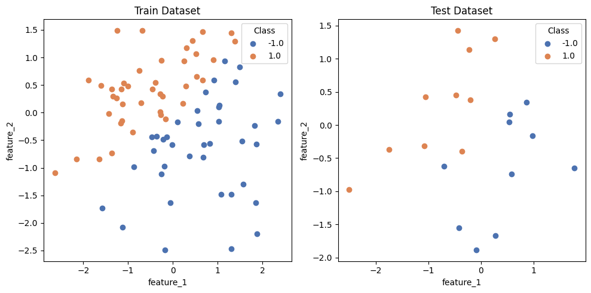
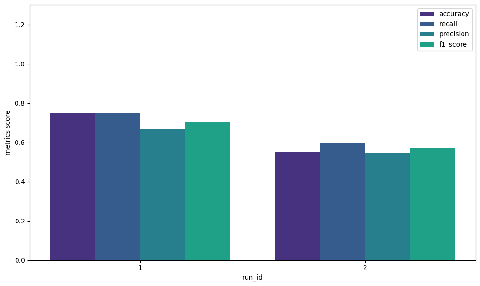
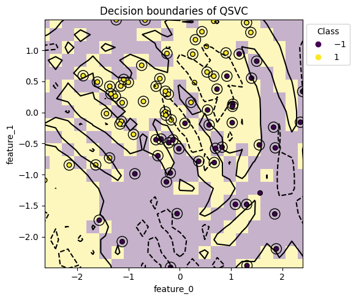

# Simple case using only the default dataset and model

このチュートリアルでは、QXMTのデフォルト機能を使って量子機械学習における実験管理の一連の流れを体験します。QXMTでは、よく使われるデータセットやその前処理、量子機械学習モデル、評価指標をデフォルト機能として提供しています。これらを活用することで実験の初期段階において効率的にベースラインを作成することができます。

QXMTでは実験を以下のディレクトリ構成に従って管理します。
- **data**: 実験で利用するデータを格納します。
- **config**: 各種実験を管理するためのYAMLファイルを格納します。
- **experiments**: 実験を管理するための情報や処理結果がプログラムによって順次格納されていきます。各フォルダは、後ほど説明するExperimentのname毎に区切られており、その配下に実際の実行結果であるrunが作成されます。

``` bash
<your_project>
├── data
├── configs
│   ├── config_1.yaml
│   ├──   ⋮
│   └── config_n.yaml
└── experiments
    ├── <your_experiment_1>
    │   ├── experiment.json
    │   ├── run_1
    │   │   └── model.pkl
    │   ├── run_2
    │   ├──   ⋮
    │   └── run_n
    │   ⋮
    └── <your_experiment_n>
```

## 1. 実験の設定
はじめに、`pip`でインストールしたパッケージをimportします。その後、実験全体を管理する`Experiment`インスタンスを作成し、`init()`メソッドで初期化を行います。`Experiment`クラスは、いくつかのメンバ変数を指定することができますが、今回は基本的な3つのみ設定します。それぞれ、以下のような役割を担っています。

- **name**:実験の名前を設定します。この名前に従って、Current Directoryに`experiments/{name}`というディレクトリが作成されます。
- **desc**:実験の概要を管理するための自由記述欄です。処理では利用されないことに加えて、文字列であること以外に制限はないため、実験を振り返る際に必要な情報を記述してください。
- **auto_gen_mode**: 各runのdescriptionをLLMを使って自動生成する機能を利用するかどうかを設定するフラグです (デフォルトでは`False`に設定)。こちらの機能を利用する場合はパッケージ利用時に`pip install qxmt[llm]`とする必要があることに加えて、環境変数`USE_LLM`を`True`に設定する必要があります。


``` python
import qxmt

exp = qxmt.Experiment(
    name="simple_tutorial",
    desc="A simple experiment to check the operation of the QXMT library",
    auto_gen_mode=False,
).init()
```

ここまでで、QXMTを用いて実験を管理するための準備が完了しました。

## 2. Runの設定
QXMTでは各実験の試行をRunという単位で管理します。Runの設定はデータセットやモデル等のインスタンスを直接`exp.run()`メソッドに渡す方式とYAML形式のconfigファイルで設定する2種類の方法があります。アドホックな検証等には実行が容易なインスタンスベースの方法も利用可能ですが、研究等の本格的な実験管理においては、より機能が充実したconfigベースの設定方法を推奨しています。

ここでは、今回のチュートリアルで利用するconfigファイルをもとに各設定項目について説明します。

- **description**: Runに対しての説明を記載します。上記「1. 実験の設定」で記載したdescriptionは実験全体に対しての説明であり、今回はrunに対する説明となります。こちらの値を空文字列とし、`auto_gen_mode=True`に設定するとLLMで自動生成したdescriptionが設定されます。
- **dataset**: runで利用するデータセットを指定します。`type`には"file"と"generate"があり、"file"を指定した場合には自身で用意したデータセットを利用し、"generate"が指定された場合はダミーデータが生成されます。今回のチュートリアルでは"generate"モードを利用しますが、より実践に近い"file"モードについては別のチュートリアルで紹介しています。
- **device**:　シミュレーションを実行する量子デバイスを設定します。現時点ではconfigベースの設定は`pennylane`のみ対応しています。
- **feature_map**: 量子特徴マップを利用する場合には、その特徴マップが実装されているモジュール名 (`module_name`)とクラス名 (`implement_name`)を指定します。`params`内にdict形式で必要なパラメータを指定することができます。今回はデフォルトで用意されている特徴マップを利用します。
- **kernel**: カーネルベースのモデルを利用する場合には、そのカーネルが実装されているモジュール名 (`module_name`)とクラス名 (`implement_name`)を指定します。`params`内にdict形式で必要なパラメータを指定することができます。今回はデフォルトで用意されているカーネルを利用します。
- **model**: 利用する機械学習モデルとそのパラメータ、保存時のファイル名を指定します。今回はデフォルトで用意されているSVMモデルを利用します。
- **evaluation**: デフォルトで用意されている評価指標のうち利用する指標名のリストを指定します

``` yaml
description: "Configuration file for the simple example"

dataset:
  type: "generate"
  path: null
  params: {}
  random_seed: 42
  test_size: 0.2
  features: null
  raw_preprocess_logic: null
  transform_logic: null

device:
  platform: "pennylane"
  name: "default.qubit"
  n_qubits: 2
  shots: null

feature_map:
  module_name: "qxmt.feature_maps.pennylane"
  implement_name: "ZZFeatureMap"
  params:
    reps: 2

kernel:
  module_name: "qxmt.kernels.pennylane"
  implement_name: "FidelityKernel"
  params: {}

model:
  name: "qsvm"
  file_name: "model.pkl"
  params:
    C: 1.0
    gamma: 0.05

evaluation:
  default_metrics: ["accuracy", "precision", "recall", "f1_score"]

```

## 3. Runの実行
ステップ2で設定したrunを実行してます。実行方法はconfigをファイルのパスとして渡す方法とインスタンスとして渡す方法の2種類があります。まず、パスを指定する方法で実行します。

``` python
config_path = "../data/configs/simple.yaml"

# input config file
artifact_1, result_1 = exp.run(config_source=config_path)
```

run実行時には、その他にも様々な引数を指定することができますが今回は最もシンプルなconfigだけを指定して場合を紹介しています。runを実行すると`artifact`と`result`が返されます。`artifact`にはrunで利用したデータセット (`artifact.dataset`)と機械学習モデル (`artifact.model`)が含まれています。`result`には、runの設定やモデルの評価結果が含まれています。これらは、次章で紹介する可視化に利用したり次のモデル開発を行う際の分析に利用することができます。

次にconfigをインスタンスとして渡し、runを実行する方法を紹介します。この方法ではモデルのパラメータ等をその場で修正しながら開発を行うことができるので、モデルの構造を探索するときなどに有用です。

``` python
import yaml

# load default config
update_config = yaml.safe_load(open(config))
# update model paramter
update_config["model"]["params"] = {'C': 0.1, 'gamma': 0.1}

# input the updated config instance
artifact_2, result_2 = exp.run(config_source=config)
```
実行結果として得られる`artifact`や`result`は、configファイルから実行した場合と同様の形式のものが得られます。

それぞれのrunの実行結果は、以下のコードを実行することで、`evaluation.default_metrics`に指定した指標のDataFrameを得ることができます。

``` python
# extract the results as a pandas dataframe
metrics_df = exp.runs_to_dataframe()

metrics_df.head()
# output
#       run_id  accuracy  precision  recall  f1_score
# 0          1	    0.75       0.66    0.75      0.70
# 1          2	    0.55       0.54    0.60      0.57
```

## 4. 結果の可視化
Experimentで管理されている複数のRunの結果を可視化するための方法をいくつか紹介します。今回紹介したもの以外にも、複数の可視化手法がライブラリとして提供されています。API Reference等を参考に自身の目的に合ったものをぜひ活用してください。また、Runの結果は前章で消化した`result`に格納されていることに加えて、DataFrameとしても取り出すことができるため、ご自身でさまざまな分析・可視化を行うことも可能です。

### 4.1 Datasetのラベル分布を可視化
今回作成したダミーデータセットのラベル分布を可視化します。この可視化を行うことで、学習データと評価データで分布に大きな乖離がないか視覚的に確認することができます。以下の例では、データセットと保存先のパス (`save_path`)のみを引数として設定しましたが、その他にも`kwargs`としてグラフのタイトル等を渡すことも可能です。また、`save_path=None`とした場合にはグラフの保存は行われません。

``` python
from qxmt.visualization import plot_2d_dataset

# extract dataset instance from run artifact
dataset = artifact_1.dataset

plot_2d_dataset(
  dataset=dataset,
  save_path=exp.experiment_dirc / f"run_{exp.current_run_id}/dataset.png"
  )
```




### 4.2 評価指標の比較
パラメータやモデルの構造を変更しながら複数のRunを実行した場合に、それらの評価指標を可視化し比較する方法を紹介します。`plot_metrics_side_by_side`では、比較したい評価指標名のリスト (dataframeのカラム名)を渡すことで各RunをX軸に取った棒グラフを作成することができます。また、今回は設定していませんが特定のRunに絞り込んで比較を行いたい場合は、引数`run_ids=[1, 3, 5, 6]`のように対象のrun_idのリストを設定することで可視化できます。

``` python
from qxmt.visualization import plot_metrics_side_by_side

# get run result as dataframe
df = exp.runs_to_dataframe()

plot_metrics_side_by_side(
  df=df,
  metrics=["accuracy", "recall", "precision", "f1_score"],
  run_ids=run_ids,
  save_path=exp.experiment_dirc / "side_by_side.png"
  )
```




### 4.3 モデルの決定境界
モデルとしてQuantum Support Vector Machine (QSVM)を利用している場合には、学習済みモデルの決定境界を可視化することができます。この可視化を活用することで、うまく分類できていない例を見つけたり、モデルの特徴を捉えるヒントを得ることができます。

引数に設定するモデルやデータセットについては、Runの`artifact`から取得することができます。`grid_resolution`は可視化する決定境界の解像度を設定することができ、高い値に設定するほど境界が滑らかになり、個々のサンプルについても分類結果を確認することができます。一方で計算時間が大幅に増加するため目的に合わせて調整してください。`support_vectors`はbool値を取り、出力するグラフのsupport vectorを◯印で囲って視認性を高めるかを制御することができます。

``` python
from qxmt.visualization import plot_2d_decisionon_boundaries

# extract model and dataset instance from run artifact
model = artifact_1.model
dataset = artifact_1.dataset

plot_2d_decisionon_boundaries(
  model=model,
  dataet=dataset,
  grid_resolution=30,
  support_vectors=True,
  save_path=exp.experiment_dirc / f"run_{exp.current_run_id}/boundary.png")
```




### バージョン情報
| Environment | Version |
|----------|----------|
| document | 2024/09/16 |
| QXMT| v0.2.1 |
